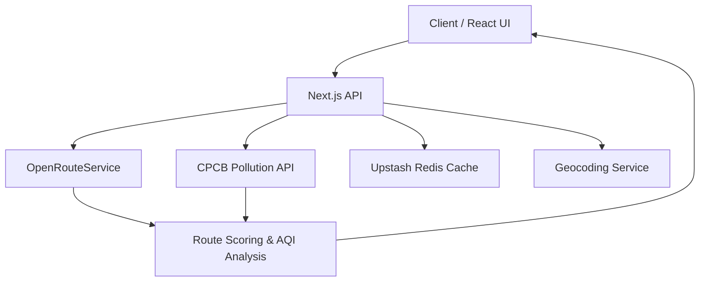

# Pollution Route Tracker

## Description
- Finds driving routes while factoring in air-quality exposure.
- Compares standard and pollution-aware routes, then ranks them by estimated AQI load.
- Optimized for the Chandigarh Metropolitan Region with a map-first UI and cached backend responses.

## Tech Stack
- Next.js 16
- React 19
- TypeScript
- Leaflet / React Leaflet
- OpenRouteService API
- CPCB / data.gov.in API
- Upstash Redis
- Upstash Ratelimit
- Zod
- Vitest
- Tailwind CSS 4

## How It Works
- User enters an origin and destination.
- Backend validates the request and keeps it within Chandigarh city limits.
- The app fetches pollution grid data and routing data from external APIs.
- Routes are scored by distance, duration, and pollution exposure.
- Results are cached in Redis and rendered on an interactive map.

## Architecture


## Run Locally
1. Install dependencies:
```bash
npm install
```
2. Set up environment variables in `.env.local`:
```bash
ORS_API_KEY=your_key
CPCB_API_KEY=your_key
UPSTASH_REDIS_REST_URL=your_url
UPSTASH_REDIS_REST_TOKEN=your_token
INTERNAL_API_SECRET=your_secret
NEXT_PUBLIC_BASE_URL=http://localhost:3000
```
3. Start the development server:
```bash
npm run dev
```
4. Open `http://localhost:3000`
